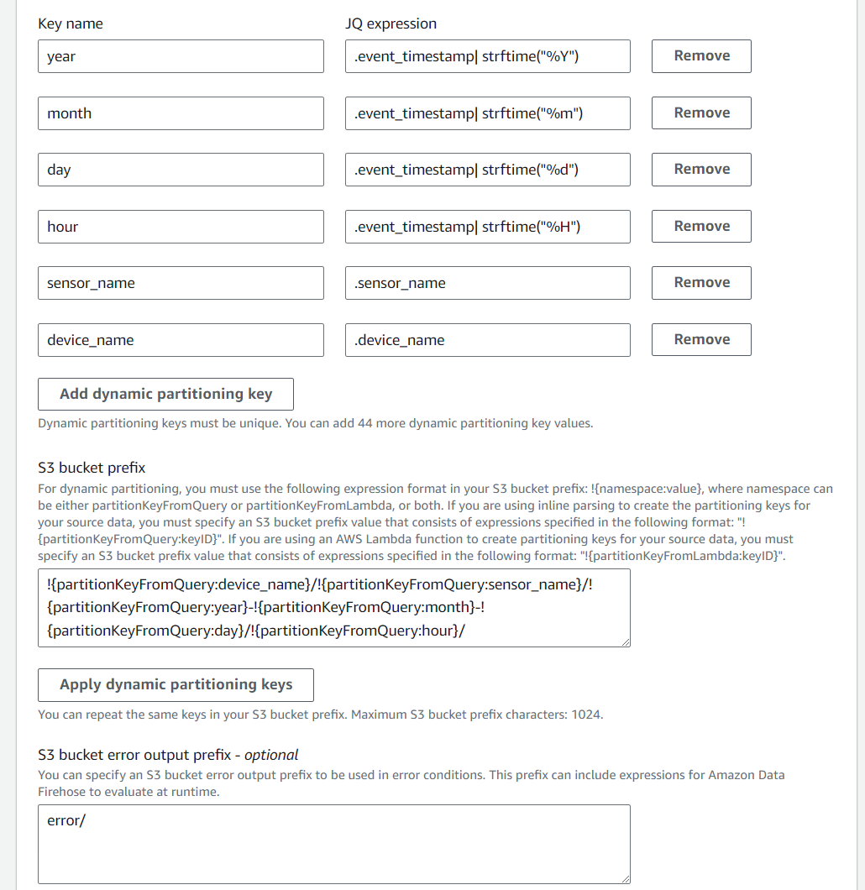

Setup: Minimal Core Functionalities
=====================================

MSight utilizes multiple AWS cloud services to achieve a rich set of functionalities. In this section, we will walk through the minimal key functionalities.
With the setup guide completed here, MSight will be function with its core functionalities ready. 

Setup Data Accomodation
----------------------------

MSight uses `AWS Kinesis <https://aws.amazon.com/kinesis/>`_ to accomodate data streaming from the edge device, therefore, one need to setup the AWS Kinesis for the edge streaming purpose.
The data streamed will be stored in `AWS S3 <https://aws.amazon.com/s3/>`_.

1. Setup S3 Cloud
~~~~~~~~~~~~~~~~~~~~~~~~~
`AWS S3 console <https://console.aws.amazon.com/s3>`_ and click the ``Create bucket`` orange button. Input a bucket name and you can leave everything else as default. 
Finally, scroll down and click ``Create bucket``.

2. Setup AWS Kinesis Data Stream
~~~~~~~~~~~~~~~~~~~~~~~~~~~~~~~~~~~~~~

Go to the `AWS Kinesis console <https://console.aws.amazon.com/kinesis>`_ and click ``create data stream``.
This will bring up a prompt look like this:

For the ``stream name``, use any name, but make sure it is the same name specified in the edge device.

In ``capacity mode``, choose ``Provisioned``, you need to specify a Provisioned Shards number based on your sensor data amount.

To do the calculation, the following rule should be applied. The per-shard capacity is 1MiB/second, and one shard will be dedicated to one sensor. 

.. note::
    For example, if you have 4 sensors, each has 1.6 MiB/second data, then each sensor will consume two shards, in total there should be 8 shards.

3. Setup AWS Kinesis Firehose
~~~~~~~~~~~~~~~~~~~~~~~~~~~~~~~~
Go to the `AWS Kinesis console <https://console.aws.amazon.com/kinesis>`_ and click ``create delivery stream``.
For the ``Source``, choose ``AWS Kinesis Data Stream``. For the ``Destination``, pick ``AWS S3``, this will pop a configuration page.
Pick the Kinesis Data Stream you created as source, and the S3 Bucket created as destination.

To make partition correct, select ``enable dynamic partition``, then enable ``New Line delimiter`` and ``Inline parsing for JSON``:

.. image:: figs/firehose_create_stream1.png

You'll need to create ``year``, ``month``, ``day`` and ``hour`` field as the example shows, and add another ``sensor_name`` field as ``.sensor_name``:

.. note::
    for this task, you can expand the ``Example record``, it has the year, month, day and hour format as is.

Use `error/` as the error output prefix, and use the following as the bucket prefix:

.. code-block::

    !{partitionKeyFromQuery:device_name}/!{partitionKeyFromQuery:sensor_name}/!{partitionKeyFromQuery:year}-!{partitionKeyFromQuery:month}-!{partitionKeyFromQuery:day}/!{partitionKeyFromQuery:hour}/

Now, your cloud is setup to accomodate the data streamed from the edge device.
