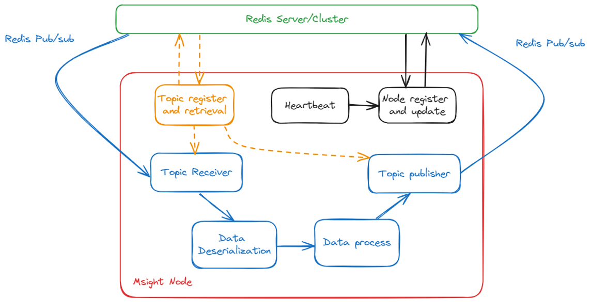

Development Guide on Nodes
========================================

This guide provides an in-depth overview of the node structure in the MSight Edge system and instructions for developers on creating custom nodes. Nodes are the core components in the MSight system, responsible for handling data streams and processing tasks within the edge infrastructure.

Overview of Nodes in MSight Edge
----------------------------------------

Nodes in the MSight Edge system are classified into three main types:

1. **Source Nodes**: Responsible for obtaining data from external sources (e.g., sensors) and injecting it into the MSight system.
2. **Data Processing Nodes**: Subscribe to topics, process the incoming data, and publish the processed data to other topics.
3. **Sink Nodes**: Special data processing nodes that only subscribe to topics and do not publish any output.

**Node Lifecycle and Structure**:

Nodes in MSight Edge are based on a hierarchy that ensures modularity and reusability. At the base level, the `Node` class provides common attributes and methods such as:
- Communication with Redis for pub/sub messaging.
- Status updates and lifecycle hooks for managing node behavior.
- A heartbeat monitor for health checks.

Redis Integration and Data Flow
----------------------------------------

Each node interacts with the Redis database to receive data (via subscribed topics) and publish processed data. The data deserialization process converts incoming raw messages into MSight standard data types, allowing developers to implement processing logic easily. The processed data is then serialized and published back to Redis, ensuring seamless data communication across nodes.

Node Class Overview
----------------------------------------

- **SourceNode**: Retrieves data from sensors, processes it if needed, and publishes it.
- **DataProcessingNode**: Listens to a subscribed topic, processes the data, and publishes the result.
- **SinkNode**: Listens to data from a topic but does not publish any output, allowing for data monitoring or external actions.

Health Monitoring
----------------------------------------

Each node includes a background thread that performs health checks. If a node fails to send heartbeats within a specified interval, it triggers an alert or takes corrective action (e.g., stopping the node).

Implementing Custom Nodes
----------------------------------------

Developers can override specific methods to implement custom logic for data handling. This modular approach helps integrate new functionalities efficiently without altering the core infrastructure.

Examples of Custom Nodes
----------------------------------------

Below are examples demonstrating how to implement custom nodes using Python.

Example 1: Custom Source Node
^^^^^^^^^^^^^^^^^^^^^^^^^^^^^^^^

A custom source node retrieves data from an external source and publishes it to a specified topic.

.. code-block:: python

   from msight_edge.nodes import SourceNode
   from msight_edge.data import MyCustomDataType
   from msight_edge import Topic

   class MyCustomSourceNode(SourceNode):
       def __init__(self, name, publish_topic):
           super().__init__(name, publish_topic, sensor_name="custom_sensor")

       def get_data(self):
           # Simulate obtaining data from a sensor
           data = MyCustomDataType(value="sample data")
           return data

       def post_process(self, data):
           # Optional data post-processing
           data.value = data.value.upper()
           return data

   if __name__ == "__main__":
       topic = Topic("my_custom_topic", MyCustomDataType)
       node = MyCustomSourceNode("custom_source_node", publish_topic=topic)
       node.spin()

Example 2: Custom Sink Node
^^^^^^^^^^^^^^^^^^^^^^^^^^^^

A custom sink node subscribes to a topic and handles data without publishing any results.

.. code-block:: python

   from msight_edge.nodes import SinkNode
   from msight_edge.data import MyCustomDataType
   from msight_edge import Topic

   class MyCustomSinkNode(SinkNode):
       def __init__(self, name, subscribe_topic):
           super().__init__(name, subscribe_topic)

       def on_message(self, data):
           # Handle incoming data
           print(f"Received data: {data.value}")

   if __name__ == "__main__":
       topic = Topic("my_custom_topic", MyCustomDataType)
       node = MyCustomSinkNode("custom_sink_node", subscribe_topic=topic)
       node.spin()

Example 3: Custom Data Processing Node
^^^^^^^^^^^^^^^^^^^^^^^^^^^^^^^^^^^^^^^

A custom data processing node subscribes to a topic, processes the data, and publishes the output.

.. code-block:: python

   from msight_edge.nodes import DataProcessingNode
   from msight_edge.data import MyCustomDataType
   from msight_edge import Topic

   class MyCustomProcessingNode(DataProcessingNode):
       def __init__(self, name, subscribe_topic, publish_topic):
           super().__init__(name, subscribe_topic, publish_topic)

       def process(self, data):
           # Process data and modify it
           data.value = f"Processed: {data.value}"
           return data

   if __name__ == "__main__":
       sub_topic = Topic("my_custom_topic", MyCustomDataType)
       pub_topic = Topic("processed_topic", MyCustomDataType)
       node = MyCustomProcessingNode("custom_processing_node", sub_topic, pub_topic)
       node.spin()

Summary
----------------------------------------

- **SourceNode**: Retrieves and publishes data.
- **SinkNode**: Subscribes to data and handles it without publishing.
- **DataProcessingNode**: Subscribes, processes, and publishes data.

These examples illustrate how developers can extend the MSight Edge system by customizing node behavior and integrating new processing logic efficiently.
