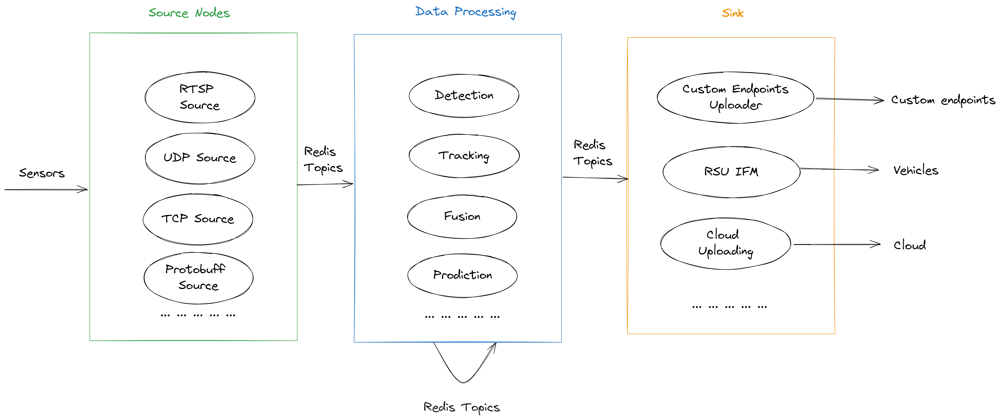

Main Concepts
================

The main idea of MSight edge library is to provide a set of executable **nodes** that can be used to build a complete application. These nodes are designed to be as independent as possible, so that they can be used in different contexts. These nodes are also designed to be as generic as possible, so that they can be used in different applications. The following figure shows the main concepts of the library.

In general, we offer three main types of nodes:
    1. **Data sources**: These nodes are responsible for reading data from a source and providing it to the rest of the nodes. The data source is typically a sensor, but it can also be a file or a web service or others. The data source is responsible for providing the data in a format that can be understood by the rest of the nodes. MSight specifies a set of data types in the form of ROS interface that can be used to represent data.
    2. **Data processors**: These nodes are responsible for processing the data provided by the data sources. The data processors can be used to perform filtering, segmentation, tracking, etc. The data processors are also responsible for providing the data in a format that can be understood by the rest of the nodes.
    3. **Data sinks**: These nodes are responsible for receiving data from the data processors and performing some action with it. The data sinks can be used to display the data, save it to a file, send it to a web service, etc.

Supported Nodes
----------------

The following table shows the list of nodes that are currently supported by MSight.

.. list-table:: Table Supported Nodes
   :widths: 15 40 10 10 10 15
   :header-rows: 1

   * - Name
     - Description
     - Node type
     - Input data type
     - Output data type
     - Status
   * - RTSP Sensor Handler
     - This node is responsible for reading data from a RTSP stream and providing it to the rest of the nodes.
     - Data source
     - RTSP stream
     - MSight SensorImage
     - Stable
   * - Bluecity Sensor Handler
     - This node is responsible for reading data from a Bluecity edge device and providing it to the rest of the nodes.
     - Data source
     - Frame from Bluecity API
     - MSight Road Object List
     - Stable 
   * - Derq Sensor Handler
     - This node is responsible for reading data from a Derq edge device and providing it to the rest of the nodes.
     - Data source
     - Derq detection result (JSON) from UDP
     - MSight Road Object List
     - Under development
   * - SDSM Message Handler
     - This node is responsible for receiving encoded SDSM message from UDP and decoding it to MSight Road Object List.
     - Data source
     - SDSM message from UDP
     - MSight Road Object List
     - Under development
   * - MSight detection node
     - This node is responsible for detecting and tracking objects in the image and providing the results to the rest of the nodes.
     - Data processor
     - MSight SensorImage
     - MSight Road Object List
     - Stable
   * - MSight fusion node
     - This node is responsible for fusing the results from different data processors and providing the results to the rest of the nodes.
     - Data processor
     - MSight Road Object List
     - MSight Road Object List
     - Under development
   * - AWS Kinesis uploader
     - This node is responsible for uploading the results to AWS Kinesis.
     - Data sink
     - MSight Road Object List
     - N/A
     - Stable
   * - CSV file writer
     - This node is responsible for writing the results to a CSV file.
     - Data sink
     - MSight Road Object List
     - N/A
     - Under development
   * - SDSM message encoder and forwarder
     - This node is responsible for encoding the results to SDSM message and sending it to UDP.
     - Data sink
     - MSight Road Object List
     - N/A
     - Under development
   * - BSM message encoder and forwarder
     - This node is responsible for encoding the results to BSM message and sending it to UDP.
     - Data sink
     - MSight Road Object List
     - N/A
     - Under development

