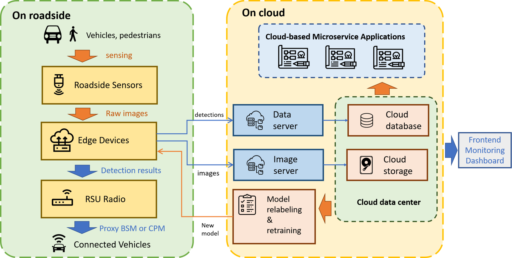

.. MSight documentation master file, created by
   sphinx-quickstart on Fri Oct 28 00:34:41 2022.
   You can adapt this file completely to your liking, but it should at least
   contain the root `toctree` directive.

Welcome to MSight's documentation!
==================================

.. note::
   This document is currently under development, consistensy will not be garanteed between this version and the formal release.

MSight is an edge-cloud infrastructure data system built for roadside perception and cooperative driving. As one of the earliest such systems, MSight considers several important features.

The above figure shows the main architecture of MSight. The system is composed of two parts: the edge part and the cloud part. The edge part is responsible for collecting data from the sensors, doing in-time processing and sending them to the cloud part. The cloud part is responsible for processing the data further. The edge part and the cloud part communicate with each other through a AWS Kinesis by default.

.. toctree::
   :glob:
   :maxdepth: 2
   :caption: Contents of this document:

   edge/index
   cloud/index

.. Indices and tables
.. ==================

.. * :ref:`genindex`
.. * :ref:`modindex`
.. * :ref:`search`

